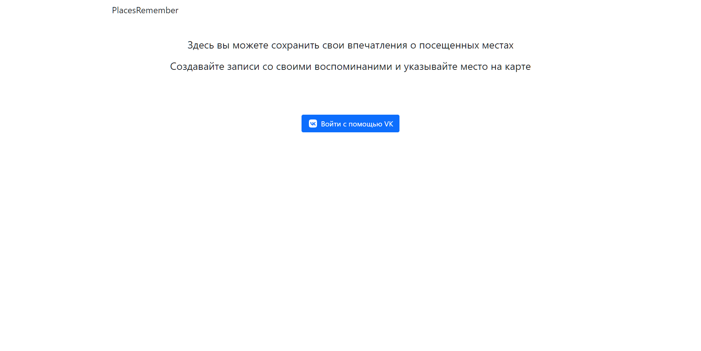
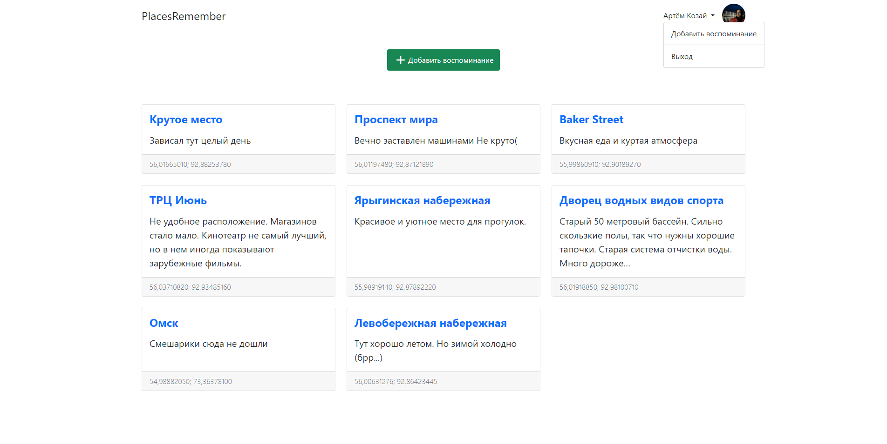
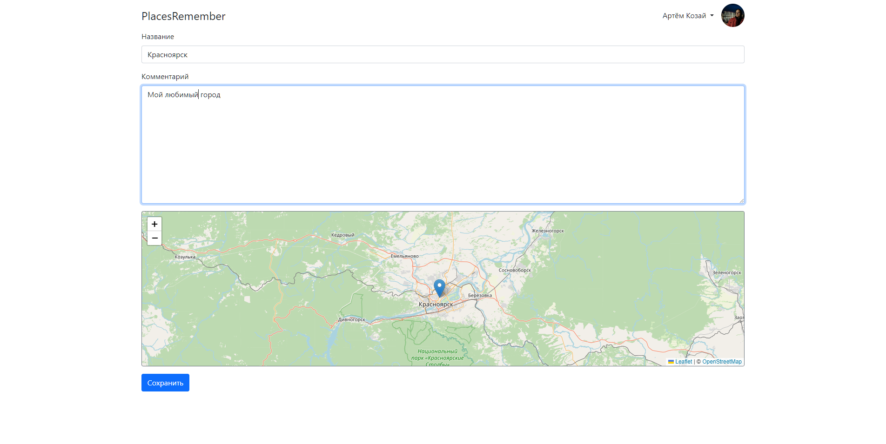

# Places Remember

Django-приложение, с помощью которого люди смогут хранить свои впечатления о посещенных
местах.

Аутентификация пользователя просиходит с помощью **OAuth Vk API**
Для реализации функции получения координат места использован **Leaflet**

Главная страница:

Список воспоминаний:

Создание и редактирование воспоминаний:

